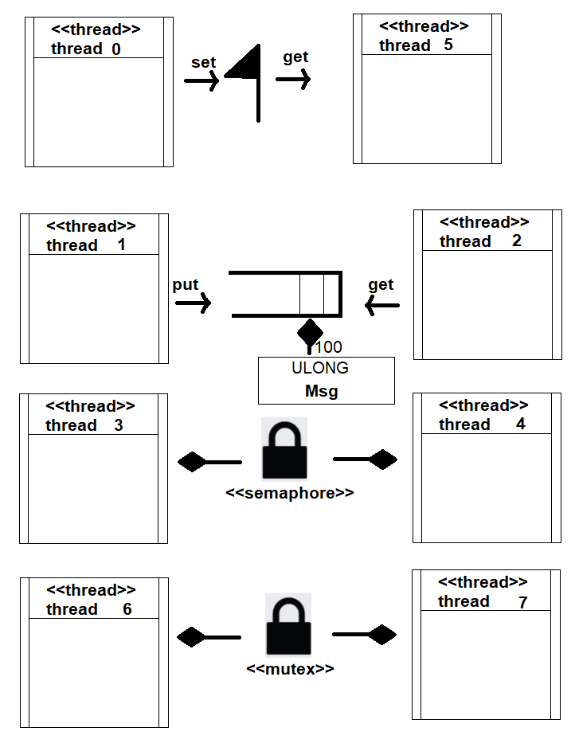

<h3>
	Tabelas
</h3>

<h3>threads in sample_threadx.c</h3>
<table>
	<tr style = "background-color:#0000FF;color:#FFFFFF">
		<th>Thread Name</th>
		<th>entry function</th>
		<th>stack size</th>
		<th>priority</th>
		<th>auto start</th>
		<th>time slicing</th>
	</tr>
	<tr>
		<th>thread 0</th>
		<th>thread_0_entry</th>
		<th>1024</th>
		<th>1</th>
		<th>yes</th>
		<th>no</th>
	</tr>
	<tr>
		<th>thread 1</th>
		<th>thread_1_entry</th>
		<th>1024</th>
		<th>16</th>
		<th>yes</th>
		<th>4</th>
	</tr>
	<tr>
		<th>thread 2</th>
		<th>thread_2_entry</th>
		<th>1024</th>
		<th>16</th>
		<th>yes</th>
		<th>4</th>
	</tr>
	<tr>
		<th>thread 3</th>
		<th>thread_3_and_4_entry</th>
		<th>1024</th>
		<th>8</th>
		<th>yes</th>
		<th>no</th>
	</tr>
	<tr>
		<th>thread 4</th>
		<th>thread_3_and_4_entry</th>
		<th>1024</th>
		<th>8</th>
		<th>yes</th>
		<th>no</th>
	</tr>
	<tr>
		<th>thread 5</th>
		<th>thread_5_entry</th>
		<th>1024</th>
		<th>4</th>
		<th>yes</th>
		<th>no</th>
	</tr>
	<tr>
		<th>thread 6</th>
		<th>thread_6_and_7_entry</th>
		<th>1024</th>
		<th>8</th>
		<th>yes</th>
		<th>no</th>
	</tr>
	<tr>
		<th>thread 7</th>
		<th>thread_6_and_7_entry</th>
		<th>1024</th>
		<th>8</th>
		<th>yes</th>
		<th>no</th>
	</tr>
</table>

<h3>
    objects in sample_threadx.c
</h3>
<table>
    <tr>
        <th>Name</th>
        <th>control structure</th>
        <th>size</th>
        <th>location</th>
    </tr>
    <tr>
        <th>byte pool 0</th>
        <th>byte_pool_0</th>
        <th>9120</th>
        <th>byte_pool_memory</th>
    </tr>
    <tr>
        <th>quque 0</th>
        <th>queue_0</th>
        <th>100 * 64</th>
        <th>pointer</th>
    </tr>
    <tr>
        <th>semaphore 0</th>
        <th>semaphore_0</th>
        <th>sizeof(TX_SEMAPHORE)</th>
        <th>&semaphore_0</th>
    </tr>
    <tr>
        <th>event flags 0</th>
        <th>event_flags_0</th>
        <th>sizeof(TX_EVENT_FLAGS_GROUP)</th>
        <th>&event_flags_0</th>
    </tr>
    <tr>
        <th>mutex 0</th>
        <th>mutex_0</th>
        <th>sizeof(TX_MUTEX)</th>
        <th>&mutex_0</th>
    </tr>
    <tr>
        <th>block pool 0</th>
        <th>block_pool_0</th>
        <th>100</th>
        <th>pointer</th>
    </tr>
</table>

<h3>Thread comunication diagram</h3>
